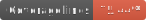

[](https://github.com/dwyl/esta/issues)
[](https://github.com/dwyl/esta/issues)
[]()

# Google Analytics reporter

This library was created with Single Page Application architecture in mind.
Its goal is to provide as simple as possible usage of Google Analytics for SPAs.

#### Some of its features that come virtually without any "price tag" are
* Reporting of virtual navigation (based on HTML5 history object) including reporting page alias and not the actual url 
* Your REST call & navigation performance to GA - so you could monitor download, server and duration times.  
* Reports the "time to first paint" for your application - i.e. how fast the users see the first meaningful page of your application (and not a blank page)
* Reporting any redux action to GA using 'reportGoogleAnalytics' decorator (annotation)
* Easily report events / pageviews / performance values 


## Installation

Install the package
```bash
npm i @impervaos/google-analytics-spa 
```

Add the following snippet in your **index.html** _(or whatever page that is loaded first)_*** 

```html
    <!-- Google Analytics -->
    <script>
        window.ga=window.ga||function(){(ga.q=ga.q||[]).push(arguments)};ga.l=+new Date;
    </script>
    <script defer src='https://www.google-analytics.com/analytics.js'></script>
    <!-- End Google Analytics -->
```
Add the following in your first JSX / JS file (the root of your SPA application)

```jsx harmony
import { googleAnalyticsInit } from '@impervaos/google-analytics-spa';
import { createBrowserHistory } from 'history';

const history = createBrowserHistory({ basename: '' });

//from https://analytics.google.com/analytics/web/#/.../admin/property/settings (your GA property page)
const myGaApplicationId = 'UA-000000-00'; 
//the name of your tracker, this is optional
const myTrackerName = 'MyTrackerName';
//report performance of pages that match this regex
const performanceRegex = /.*localhost.*/i;

//every request will also carry these dimensions with it
const customDimensions = {
                           dimension1: 'dim1',
                           dimension2: 'dim2',
                           dimension3: Date.now(), //example: session start timestamp 
                         };
//GA tracker properties (https://developers.google.com/analytics/devguides/collection/analyticsjs/field-reference)  
const properties = { userId: 1 }; //example reporting userId

googleAnalyticsInit( myGaApplicationId,
                     myTrackerName,
                     history,
                     performanceRegex,
                     properties,
                     customDimensions
);
```

***_I decided not to embed the ga.js code, since google promissed to change it unexpectedly_
## Usage Example

```jsx harmony
import { tracker, googleAnalyticsInit } from '@impervaos/google-analytics'; 

//event reporting
function reportClick() {
    tracker.reportAction( 'MY_CATEGORY', 'Button_CLICK', 'open button clicked', 0 )
}

//manual page view reporting (i.e. reporting that navigation was done to page http://page.com/first) 
tracker.reportPage( 'my site title', 'http://page.com/first' );

//navigating to another page in the application
// @imperva/google-analytics will report navigation to page called '/virtual/path' automatically instead of reporting navigation to '/test/path'
history.push( '/test/path', gaBuildPageViewState( 'TITLE', '/virtual/path', true ) );

//react example
render() {
    return (
        <div>
           <button onClick={reportClick} />
        </div>
    );
}


```
## Tracker object

#### setUserId

Sets user id inside the object and also inside the tracker

##### Parameters

-   `identifier` **[string][31]** identifier that is used to identify this specific user across multiple sessions and / or devices

#### reportAjaxDuration

Reports the whole durations of the request, from initiation to last byte receipt

##### Parameters

-   `category` **[string][31]** 
-   `name` **[string][31]** 
-   `label` **[string][31]** 

#### reportAjaxWait

Reports the server waiting time until download starts

##### Parameters

-   `category` **[string][31]** 
-   `name` **[string][31]** 
-   `label` **[string][31]** 

#### reportAjaxDownload

Reports the resource download time

##### Parameters

-   `category` **[string][31]** 
-   `name` **[string][31]** 
-   `label` **[string][31]** 

#### reportHumanAction

Wrapper for action report performed by human
Automatically sets tha category to CATEGORY_HUMAN

##### Parameters

-   `action` **[Object][32]** action performed
-   `label` **[string][31]** label of the action
-   `value` **[number][33]** value of hte action (in $)

#### reportMachineAction

Wrapper for action report performed by the system
Automatically sets tha category to CATEGORY_MACHINE

##### Parameters

-   `action` **[Object][32]** action performed
-   `label` **[string][31]** label of the action
-   `value` **[number][33]** value of hte action (in $)

#### reportPage

Reports page view
Usually theres no need to report pages manually, since this feature is turned on automatically

##### Parameters

-   `title` **[string][31]** reported page title
-   `page` **[string][31]** page url (optional, default `window.location.pathname`)

#### reportAction

Reporting an action performed
All arguments are strings

##### Parameters

-   `category` **[string][31]** action category
-   `action` **[Object][32]** action itself
-   `label` **[string][31]** label of an action (optional, default `''`)
-   `value` **[number][33]** $ value of the action

#### reportException

Reporting an exception to GA

##### Parameters

-   `exDescription` **[string][31]** 
-   `isFatal` **[boolean][34]** 

#### googleAnalyticsInit

Run this function as soon as possible in your code in order to initialize google analytics reporting

##### Parameters

-   `trackerId` **[string][31]** Id of your app defined in Google analytics account, usually starts with UA-
-   `trackerName` **[string][31]** a name to represent a GA tracker. Useful if you want to have 2 separate GA trackers
-   `history` **[Object][32]** history object. we are using [https://www.npmjs.com/package/history][35]
-   `performanceAllowOnlyRegex` **[string][31]** used for REST performance logging purposes. Only pages who's url matches the regex will be reported.
    if left empty will not report anything (optional, default `null`)
-   `gaProperties` **[Object][32]** ga properties including the userId property.
-   `gaDimesions` **[Object][32]** ga dimensions object with key value pairs of dimensions (dimension1, dimension2...) to report every time

Returns **GaTracker** the singleton object through which reporting is made

#### gaBuildPageViewState

This function is a POJO that suplies the structure that is consumed by GA when reporting a page view
Usually this is only used when you need to report a virtual page
(example: dashboard country -> incidents list filtered by country, we report incidents/country/FR

##### Parameters

-   `title` **[string][31]** reported page title
-   `virtualPath` **[string][31]** the virtual path
-   `isVirtualPathOnly` **[string][31]** (default: false) when true the virtual page will be appended to the actual path, false will replace it completely (optional, default `false`)

Returns **{virtualPath: any, isVirtualPathOnly: [boolean][34], title: any}** 


## Contributing
Pull requests are welcome. For major changes, please open an issue first to discuss what you would like to change.

Please make sure to update tests as appropriate.

## License
[ISC](https://choosealicense.com/licenses/isc/)
